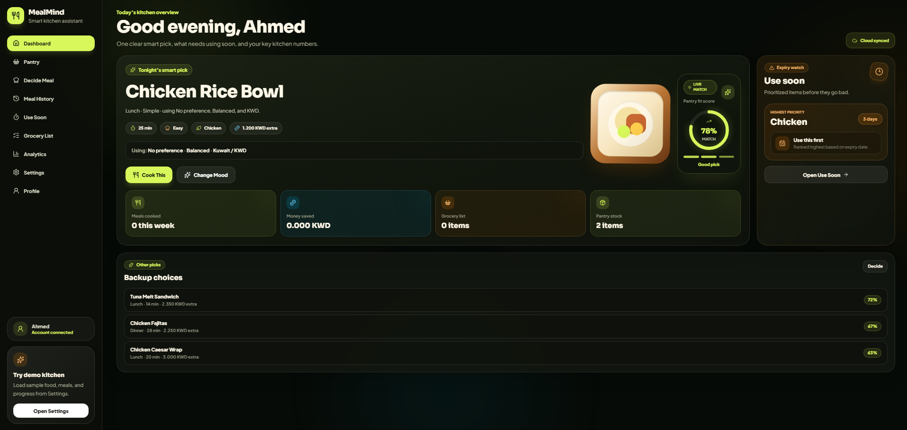

# 🍽️ MealMind

**MealMind** is a smart kitchen assistant web app that helps users manage pantry items, decide what to cook, build grocery lists, save meals, and track cooking progress.

The goal of MealMind is simple: help users waste less food, avoid buying duplicate groceries, and make daily meal decisions easier using pantry-aware recommendations.

---

## ✨ Key Features

### 🔐 User Accounts and Cloud Sync

- Register and log in using Supabase Authentication
- Save each user’s data separately
- Sync pantry items, grocery list, saved meals, cooked history, and settings across devices
- Secure user data using Supabase Row Level Security policies

### 🧺 Pantry Management

- Add and manage pantry items
- Track item name, quantity, category, storage location, and expiry date
- Highlight urgent, fresh, shelf-stable, and use-soon items
- Repair and refresh expiry data when needed

### 🍳 Decide Meal

- Recommend meals based on available pantry ingredients
- Filter meals by type, mood, time, and budget
- Use user preferences such as diet, region, currency, and budget behavior
- Show ingredients already available and ingredients still needed
- Save recommended meals to Meal History

### 🛒 Grocery List

- Add grocery items manually
- Add missing ingredients from meal recommendations
- Mark items as bought
- Move bought items into the pantry
- Reduce duplicate shopping items

### 📚 Meal History

- Save meals for later
- Mark meals as cooked
- Add missing ingredients to the grocery list
- Track cooked meal history
- Estimate missing ingredient prices

### ⏰ Use Soon

- Show pantry items that should be used before they expire
- Prioritize urgent food items
- Suggest meal ideas based on expiring ingredients
- Mark items as used and remove them from pantry

### 📊 Analytics

- Track total cooked meals
- Estimate money saved compared to takeaway meals
- Show weekly cooking progress
- Display favorite meal categories
- Track repeat meals and progress achievements

### ⚙️ Settings

- Choose region and currency
- Set diet preference
- Control budget behavior
- Adjust expiry reminder strictness
- Enable or disable smart helper options
- Clear pantry, grocery list, saved meals, cooked history, or all app data
- Load demo kitchen data for testing

---

## 🧰 Tech Stack

- **React**
- **Vite**
- **Tailwind CSS**
- **Supabase**
- **Supabase Auth**
- **Supabase PostgreSQL Database**
- **Framer Motion**
- **Recharts**
- **Lucide React**

---

## 📁 Project Structure

```txt
frontend/
├── public/
├── src/
│   ├── components/
│   ├── context/
│   ├── data/
│   ├── layouts/
│   ├── lib/
│   ├── pages/
│   ├── App.jsx
│   ├── index.css
│   └── main.jsx
├── .env.example
├── .gitignore
├── package.json
├── README.md
└── vite.config.js
```

---

## 🔑 Environment Variables

Create a `.env.local` file inside the `frontend` folder.

Use this format:

```env
VITE_SUPABASE_URL=your_supabase_project_url_here
VITE_SUPABASE_ANON_KEY=your_supabase_anon_key_here
```

A safe example file is included:

```txt
.env.example
```

> Do not upload `.env.local` to GitHub because it contains real Supabase project keys.

---

## ▶️ How to Run Locally

Clone the repository:

```bash
git clone https://github.com/your-username/mealmind.git
```

Go into the project folder:

```bash
cd mealmind/frontend
```

Install dependencies:

```bash
npm install
```

Create your local environment file:

```bash
cp .env.example .env.local
```

Add your Supabase URL and anon key inside `.env.local`.

Start the development server:

```bash
npm run dev
```

Open the local URL shown in the terminal.

---

## 🗄️ Supabase Setup

MealMind uses Supabase for authentication and cloud database storage.

The app expects these main tables:

```txt
profiles
user_settings
pantry_items
grocery_items
saved_meals
cooked_history
```

Each table should include a `user_id` column so every user only accesses their own records.

Row Level Security should be enabled so authenticated users can manage only their own data.

---

## 🔄 Main User Flow

```txt
1. User registers or logs in
2. User adds pantry items
3. MealMind suggests meals based on available ingredients
4. User saves meals to Meal History
5. Missing ingredients can be sent to Grocery List
6. Bought grocery items can be moved into Pantry
7. Cooked meals are tracked in Analytics
8. Settings personalize recommendations and expiry behavior
```

---

## 🖼️ Screenshots

screenshots:

```txt
- Login / Register page
- Dashboard
- Pantry
- Decide Meal
- Grocery List
- Meal History
- Use Soon
- Analytics
- Settings
```

```md

```

---

## 🚀 Future Improvements

- Barcode scanning for pantry items
- Receipt scanning to auto-add grocery purchases
- Better mobile camera support
- AI-powered meal generation
- Meal planning calendar
- Push notifications for expiry reminders
- Shared household pantry accounts
- More detailed nutrition tracking
- Dark and light theme options

---

## 🎯 Purpose of the Project

MealMind was built to demonstrate a full-featured, cloud-connected React application with a practical real-life use case.

The project focuses on:

- Modern frontend development
- Clean UI/UX design
- Cloud authentication
- Database-backed app state
- User-specific data management
- Practical problem solving for food waste and grocery planning

---

## ✅ Project Status

MealMind is currently a working full-stack frontend project connected to Supabase.

Core pages and cloud sync are functional, including:

- Authentication
- Pantry
- Grocery List
- Meal History
- Settings
- Dashboard
- Use Soon
- Decide Meal
- Analytics
